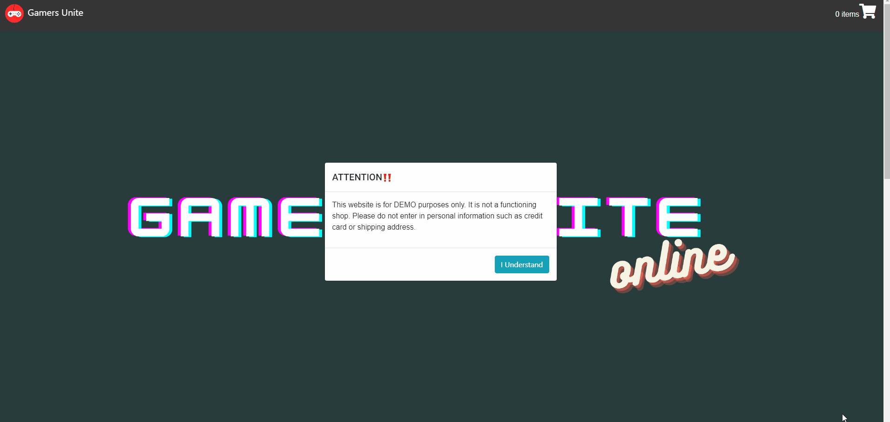

# Gamers-Unite
An interactive full stack shopping cart application built with Node.js and React, simulating a gaming console e-commerce site

## Technologies Used
* Babel
* BootStrap 4
* CSS3
* Express
* HTML5
* JavaScript ES6
* Media Queries
* Node.js
* npm
* React
* Webpack

## Live Demo
Test the live application at https://gamers-unite.phamjo.com/

## Features
* User can view products for sale - Back End.
* User can view products for sale - Front End.
* User can view details of a product - Back End.
* User can view details of a product - Front End.
* User can add product to their cart - Back End.
* User can add product to their cart - Front End.
* User can view their cart summary - Front End.
* User can place an order - Back End.
* User can place an order - Front End.

## Preview


### Getting Started
1. Clone the repository
    ```shell
    git clone https://github.com/joanna-pham/wicked-sales-js
    cd wicked-sales-js
    ```
2. Install all dependencies with npm.
    ```shell
    npm install
    ```
3. Start the project. Once started you can view the application by opening http://localhost:3000 in your browser.
    ```shell
    npm run dev
    ```
